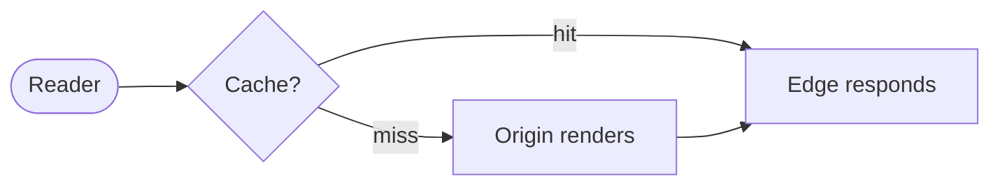

# Notes by Lessa

A calm, distraction-free personal blog built for **reading first**. Prose carries
the idea; small interactive "islands" carry the parts prose can't. Pages ship
**zero JavaScript** unless a component genuinely needs to move.

- **Stack:** [Astro](https://astro.build) + MDX, interactive islands in Vue.
- **Type:** [Atkinson Hyperlegible](https://www.brailleinstitute.org/freefont/)
  (self-hosted via Fontsource), tuned for low-vision legibility.
- **Accessibility:** WCAG-first. Light + dark, both first-class. Keyboard-navigable,
  visible focus, skip link, reduced-motion aware, AAA body contrast where feasible.
- **No** trackers, popups, cookie banners, newsletter modals, or autoplaying anything.

---

## Run it

```bash
npm install
npm run dev      # local dev server
npm run build    # production build → dist/
npm run preview  # serve the production build
npm test         # accessibility + interaction tests (Playwright + axe)
npm run lhci     # Lighthouse budgets
```

> **Diagrams need a browser at build time.** `mermaid` code fences are rendered
> to static SVG using headless Chromium. CI runs `npx playwright install chromium`.
> If your local Chromium lives elsewhere, point the build at it:
> `PLAYWRIGHT_CHROMIUM_PATH=/path/to/chrome npm run build`.

Requires Node 22+.

---

## Write a post

Posts are MDX files in `src/content/blog/`. Frontmatter is type-checked (Zod) —
a typo fails the build instead of shipping broken metadata.

```mdx
---
title: The TLS handshake, without the hand-waving
description: One-sentence summary used in listings, meta tags, and RSS.
pubDate: 2026-06-22
updated: 2026-06-30        # optional
tags: ['security', 'networking']
draft: false               # drafts are excluded from build, RSS, and sitemap
hero: ./cover.png          # optional image (place beside the post)
heroAlt: Describe the image
---

import Stepper from '../../components/islands/Stepper.vue';

Your prose here. Import islands and drop them inline (see below).
```

The post is served at `/blog/<filename>/`. The home page and RSS list it
automatically, newest first.

### Schema (`src/content.config.ts`)

| field         | type       | notes                                  |
| ------------- | ---------- | -------------------------------------- |
| `title`       | string     | ≤ 120 chars                            |
| `description` | string     | ≤ 280 chars; used in meta + RSS        |
| `pubDate`     | date       | required                               |
| `updated`     | date?      | optional "Updated" date                |
| `tags`        | string[]   | defaults to `[]`                       |
| `draft`       | boolean    | defaults to `false`                    |
| `hero`        | image?     | optional, validated + optimized        |
| `heroAlt`     | string?    | alt text for the hero                  |

---

## The interactive islands

All four live in `src/components/islands/`. Each is keyboard-operable, respects
`prefers-reduced-motion`, captioned, and **degrades to a static frame + text** when
JavaScript is off (they're server-rendered, then hydrate with `client:visible`).
See them running on the [`/demos`](src/pages/demos.mdx) page.

### 1. Diagram (build-time Mermaid)

A fenced ` ```mermaid ` block, rendered to inline SVG at build (zero JS). Wrap in
`<Figure variant="diagram">` for a caption and a light "paper" card.

````mdx
import Figure from '../../components/Figure.astro';

<Figure variant="diagram" caption="Request lifecycle." wide>



</Figure>
````

### 2. Stepper — `Stepper.vue`

Walk a concept step by step. Prev/next, counter, arrow keys, deep-linkable steps.

```mdx
<Stepper
  id="unique-id"
  client:visible
  label="What this walkthrough covers"
  steps={[
    { title: 'First', body: '<p>HTML is allowed in <code>body</code>.</p>' },
    { title: 'Second', body: '<p>…</p>' },
  ]}
/>
```

### 3. Replayable sequence diagram — `SequencePlayer.vue`

Play / pause / step / scrub a message flow between actors.

```mdx
<SequencePlayer
  client:visible
  title="Token refresh"
  caption="One-line summary."
  actors={[{ id: 'c', label: 'Client' }, { id: 's', label: 'Server' }]}
  messages={[
    { from: 'c', to: 's', label: 'Request', note: 'Narration for this step.' },
    { from: 's', to: 'c', label: 'Response' },
  ]}
/>
```

### 4. Loop player — `LoopPlayer.vue`

A replayable cycle for cyclic mental models.

```mdx
<LoopPlayer
  client:visible
  title="Build–measure–learn"
  frames={[
    { label: 'Build', caption: 'Ship the smallest test.' },
    { label: 'Measure', caption: 'Observe real behavior.' },
    { label: 'Learn', caption: 'Decide the next move.' },
  ]}
/>
```

> Use `client:visible` so the island's JS loads only when it scrolls into view.
> Wrap an island in `<div class="wide">…</div>` to let it break out past the
> reading measure.

---

## Add a new island

1. Create `src/components/islands/MyIsland.vue`.
2. Reuse `usePlayhead` (`src/lib/usePlayhead.ts`) for play/pause/scrub state and
   the shared `PlayerControls.vue` for a consistent, accessible transport bar.
3. Render a sensible **static first frame** on the server (no `window` access
   during render — use `onMounted`) so it degrades without JS.
4. Gate any "hide inactive content" CSS on an `is-interactive` class you add in
   `onMounted`, so the no-JS render shows everything.
5. Import it in a post/page and add it with `client:visible`.

---

## Design system

Tokens live in `src/styles/tokens.css` — one place, semantic names, documented
rationale: a modular fluid **type scale**, a strict **4px spacing grid**, a ~65ch
reading **measure**, **radii**, and **motion** (150ms micro / 200–300ms content).
Components reference only semantic tokens (`--color-text`, `--space-5`, …). Base
styles and the reading layout are in `src/styles/global.css`.

Light is the default (warm off-white paper, not glaring white); dark is warm
near-black. The theme is set before first paint by a tiny inline script and
toggled via the header button (persisted to `localStorage`, otherwise follows the
OS).

---

## Project layout

```
src/
  components/
    islands/        Stepper, SequencePlayer, LoopPlayer, PlayerControls (Vue)
    *.astro         Header, Footer, ThemeToggle, BaseHead, Figure, cards
  content/blog/     posts (.mdx) + content.config.ts schema
  layouts/          BaseLayout, PostLayout, PageLayout
  lib/              usePlayhead composable
  pages/            index, about, demos.mdx, 404, blog/[...slug], rss.xml.js
  styles/           tokens.css, global.css
tests/              a11y + interaction (Playwright + axe)
```

## Deployment (GitHub Pages)

CI (`.github/workflows/ci.yml`) runs build + accessibility tests + Lighthouse
budgets on every push. The deploy workflow (`.github/workflows/deploy.yml`)
publishes the site to GitHub Pages.

**One-time setup** (the Actions token can't do this for you): in the repo,
go to **Settings → Pages → Build and deployment → Source** and choose
**GitHub Actions**. Then re-run the latest "Deploy to GitHub Pages" workflow
(or push again). After that, every push to the deploy branch publishes
automatically at `https://heitorlessa.github.io/site/`.

> GitHub Pages on a **private** repo requires a paid plan (Pro/Team/Enterprise).
> On a free plan, either make the repo public or deploy the static `dist/` folder
> to any static host (Netlify, Cloudflare Pages, etc.) — set `SITE_URL`/`SITE_BASE`
> to match the host (`SITE_BASE=/` for a root domain).
