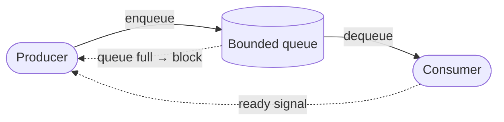

import LoopPlayer from '../../components/islands/LoopPlayer.vue';
import Figure from '../../components/Figure.astro';

A producer makes work. A consumer does it. When the producer is faster than the
consumer — even briefly — the gap has to go *somewhere*. Where it goes decides
whether your system slows down gracefully or falls over.

The naive answer is "add a bigger buffer." That only moves the cliff further
away. The real answer is **backpressure**: let the slow part tell the fast part
to ease off.

## The picture

Think of a bucket with a hole in the bottom. Water pours in from the top
(the producer). It drains through the hole (the consumer). If you pour faster
than it drains, the level rises. A bigger bucket buys time — it does not change
the fact that, sooner or later, it overflows.

<Figure variant="diagram" caption="Producer, queue, consumer — with the feedback edge that makes it stable." wide>



</Figure>

The dotted edges are the whole point. Without them, the producer is blind: it
pours regardless. With them, a full queue *blocks* the producer — the system
self-regulates.

## It's a loop, not a line

Backpressure is easier to hold in your head as a cycle you can replay. Watch it
run: the queue fills, a signal travels back, the producer eases, the queue
drains, and round it goes.

<LoopPlayer
  client:visible
  title="The backpressure control loop"
  caption="Each phase feeds the next. The signal traveling backward is what keeps the queue bounded."
  frames={[
    { label: 'Fill', caption: 'The producer enqueues faster than the consumer drains. The queue level rises.' },
    { label: 'Signal', caption: 'The queue nears its limit and pushes a "slow down" signal back upstream.' },
    { label: 'Ease', caption: 'The producer blocks or slows — it stops outpacing the consumer.' },
    { label: 'Drain', caption: 'The consumer catches up and the queue level falls back to safe.' },
  ]}
/>

## In code

Most runtimes give you backpressure for free if you let them. A bounded queue
that *blocks* on a full buffer turns the whole chain into one self-pacing
pipeline:

```ts
// A bounded channel: send() waits when the buffer is full.
const channel = new BoundedChannel<Job>({ capacity: 100 });

// Producer — naturally paced by the consumer's speed.
async function produce(source: AsyncIterable<Job>) {
  for await (const job of source) {
    await channel.send(job); // blocks when the queue is full → backpressure
  }
  channel.close();
}

// Consumer — pulls at its own rate.
async function consume() {
  for await (const job of channel) {
    await handle(job);
  }
}
```

The single `await` on `send` is doing the heavy lifting. When the buffer is
full, the producer's loop simply *waits* — no overflow, no unbounded memory, no
dropped work.

## What backpressure buys you

- **Bounded memory** — the queue can't grow without limit, so you don't OOM
  under a traffic spike.
- **Graceful degradation** — throughput drops to the consumer's real rate
  instead of collapsing.
- **Honest signals** — upstream learns the true capacity, so it can shed load or
  scale out deliberately rather than guessing.

> A buffer hides the imbalance. Backpressure *reports* it. Only one of those
> survives a sustained overload.

## Where teams get it wrong

The classic mistake is an *unbounded* queue — it feels safe ("we'll never drop a
message") but it just trades a fast, visible failure for a slow, invisible one:
latency creeps up, memory climbs, and the system dies far from the actual cause.
Bound your queues. Let the slow part push back. The discomfort of a blocked
producer is the system telling you the truth in time to act.
