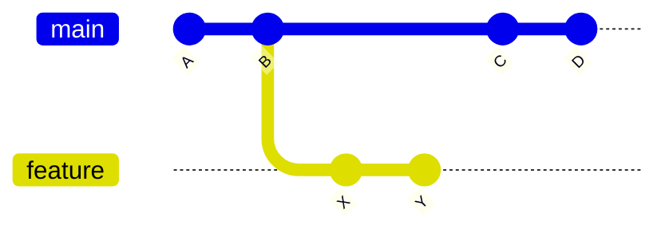
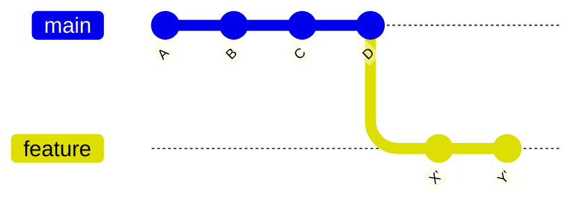

import Stepper from '../../components/islands/Stepper.vue';
import Figure from '../../components/Figure.astro';

`git rebase` has a bad reputation it doesn't deserve. The fear comes from not
being able to *see* what it does. So let's make it visible.

The one idea to hold onto: **rebase copies your commits and replays them on top
of a new base.** Your originals aren't edited — new commits are created with new
identities.

## Before and after

Say you branched off `main`, made two commits, and meanwhile `main` moved on:

<Figure variant="diagram" caption="Before: your feature branch is based on an old commit of main." wide>



</Figure>

`git rebase main` lifts `X` and `Y` off `B` and replays them after `D`, giving
`X'` and `Y'` — the same changes, new commits, a straight line.

<Figure variant="diagram" caption="After: your work sits on top of the latest main, as if you branched today." wide>



</Figure>

No merge commit, no tangle — just a clean, linear history that's far easier to
read and to bisect later.

## What actually happens, step by step

<Stepper
  id="rebase-steps"
  client:visible={{ rootMargin: '500px' }}
  label="How a rebase replays commits"
  steps={[
    { title: 'Find the common ancestor', body: '<p>Git finds where your branch and the new base diverged — here, commit <code>B</code>.</p>' },
    { title: 'Save your commits as patches', body: '<p>Everything after the ancestor (<code>X</code>, <code>Y</code>) is set aside as a list of changes to re-apply.</p>' },
    { title: 'Move to the new base', body: '<p>Your branch pointer is moved to the tip of <code>main</code> (<code>D</code>).</p>' },
    { title: 'Replay, one at a time', body: '<p>Each saved change is applied in order, creating <code>X\'</code> then <code>Y\'</code>. A conflict just pauses the replay for you to resolve.</p>' },
    { title: 'Repoint the branch', body: '<p>Your branch now points at <code>Y\'</code>. The old <code>X</code>/<code>Y</code> are unreferenced and will be garbage-collected.</p>' },
  ]}
/>

## The commands

```bash
# Replay the current branch on top of the latest main
git switch feature
git fetch origin
git rebase origin/main

# If a commit conflicts, fix the files, then:
git add <files>
git rebase --continue     # or: git rebase --abort to bail out safely
```

Because rebase rewrites commits, only force-push a rebased branch that others
aren't building on — and use the safe form:

```bash
git push --force-with-lease
```

`--force-with-lease` refuses to overwrite the remote if someone else pushed in
the meantime. It's the seatbelt for rewriting history.

## When to rebase, when to merge

- **Rebase** your own feature branch onto `main` to keep a clean, linear
  history before opening a PR.
- **Merge** when you want to preserve the true shape of how work came together,
  or when the branch is shared and rewriting would disrupt others.

Rebase isn't dangerous. Rewriting *shared* history is. Keep that line clear and
rebase becomes one of your sharpest everyday tools.
