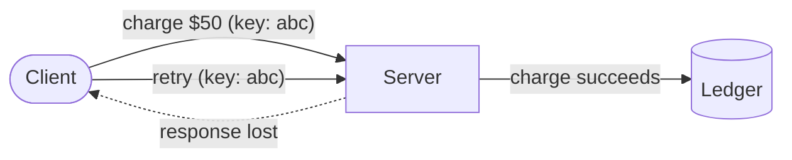

import SequencePlayer from '../../components/islands/SequencePlayer.vue';
import Figure from '../../components/Figure.astro';

Here's a problem every payments team meets: a client sends "charge $50," the
network drops the *response*, and the client — having no idea whether it worked —
retries. Without protection, that's two charges for one purchase.

The fix is small and elegant: an **idempotency key**. The client attaches a
unique id to the request; the server promises that the same key never does the
work twice.

## The danger, then the fix

The failure isn't the request being lost — it's the *response* being lost, so
the client can't tell "done" from "never happened."

<Figure variant="diagram" caption="A lost response looks identical to a lost request — the client must retry, and the server must cope." wide>



</Figure>

## What the key changes

Step through a retry with an idempotency key. The second request carries the
*same* key, so the server returns the first result instead of charging again.

<div class="wide">
<SequencePlayer
  client:visible
  title="A safe retry"
  caption="Same key → same result. The card is charged exactly once."
  actors={[
    { id: 'c', label: 'Client' },
    { id: 's', label: 'Server' },
    { id: 'd', label: 'Store' },
  ]}
  messages={[
    { from: 'c', to: 's', label: 'POST /charge (key: abc)', note: 'First attempt, carrying a unique idempotency key.' },
    { from: 's', to: 'd', label: 'Save key + charge', note: 'Server records the key and performs the charge atomically.' },
    { from: 's', to: 'c', label: '200 (charged)', note: 'The response is sent — but it never arrives.' },
    { from: 'c', to: 's', label: 'POST /charge (key: abc)', note: 'The client, unsure, retries with the SAME key.' },
    { from: 's', to: 'd', label: 'Look up key abc', note: 'Server sees the key already exists.' },
    { from: 's', to: 'c', label: '200 (same result)', note: 'It replays the stored response — no second charge.' },
  ]}
/>
</div>

## The server logic

The whole trick is: store the key and the result together, atomically, and check
for it first.

```ts
async function charge(req: ChargeRequest) {
  const key = req.headers['idempotency-key'];
  if (!key) throw new BadRequest('Idempotency-Key required');

  // Already seen this key? Replay the stored response.
  const existing = await store.get(key);
  if (existing) return existing.response;

  // First time: do the work and record it in ONE transaction.
  return store.transaction(async (tx) => {
    const result = await performCharge(req);
    await tx.put(key, { response: result });
    return result;
  });
}
```

Two details make or break it:

- **Atomicity** — writing the key and doing the work must succeed or fail
  together. Otherwise a crash between them reintroduces the double-charge.
- **Concurrency** — two retries can race. A unique constraint on the key (or a
  lock) ensures only one wins; the other reads the stored result.

## Practical notes

- **Keys come from the client**, generated once per logical operation (a UUID),
  and reused across retries of *that same* operation.
- **Give keys a TTL.** You don't need to remember them forever — hours to days
  usually covers realistic retry windows.
- **Only unsafe methods need this.** `GET` is already idempotent; it's `POST`
  (and non-idempotent `PATCH`) that benefit.

An idempotency key is a few lines of server code and one client header. In return
you get retries you can trust — the backbone of any reliable API.
