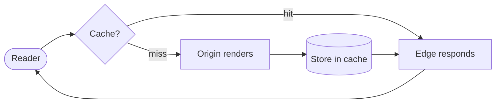

import Figure from '../components/Figure.astro';
import Stepper from '../components/islands/Stepper.vue';
import SequencePlayer from '../components/islands/SequencePlayer.vue';
import LoopPlayer from '../components/islands/LoopPlayer.vue';

## 1 — Diagram (build-time Mermaid)

Static diagrams are written as a fenced ` ```mermaid ` block and rendered to
inline SVG **at build time** using headless Chromium. Readers get a crisp vector
diagram with **zero client-side JavaScript**. Wrap it in `<Figure>` for a caption
and the always-light “paper” card that keeps Mermaid legible in dark mode.

<Figure variant="diagram" caption="Request lifecycle — rendered to SVG at build, no JS shipped." wide>



</Figure>

## 2 — Stepper

Walk a concept one idea at a time. Prev/next, a step counter, **arrow keys** when
focused (try it), and each step is **deep-linkable** via the URL hash. Without JS,
every step renders stacked so nothing is hidden.

<Stepper
  id="demo-stepper"
  client:visible
  label="How an interactive island hydrates"
  steps={[
    { title: 'Server renders HTML', body: '<p>Astro renders the component to static HTML at build time. The reader sees content instantly — no waiting on JavaScript.</p>' },
    { title: 'JS stays parked', body: '<p>With <code>client:visible</code>, the island\'s JavaScript is <em>not</em> downloaded until the component scrolls into view.</p>' },
    { title: 'Hydration on demand', body: '<p>When it appears, just this island hydrates. The rest of the page remains static HTML.</p>' },
    { title: 'Interactive — and reversible', body: '<p>Now it responds to clicks, keys, and the scrubber. Turn JS off and it falls back to a readable static frame.</p>' },
  ]}
/>

## 3 — Replayable sequence diagram

The marquee piece. Play, pause, step, or scrub the timeline to replay a message
flow at your own pace. The active message animates in and is narrated by a live
caption; screen readers get the full sequence as an ordered list.

<div class="wide">
<SequencePlayer
  client:visible
  title="Token refresh"
  caption="A client transparently refreshes an expired access token, then retries."
  actors={[
    { id: 'c', label: 'Client' },
    { id: 'a', label: 'Auth' },
    { id: 'r', label: 'Resource' },
  ]}
  messages={[
    { from: 'c', to: 'r', label: 'GET /data', note: 'Client calls the API with an expired access token.' },
    { from: 'r', to: 'c', label: '401 Unauthorized', note: 'The resource rejects it — the token has expired.' },
    { from: 'c', to: 'a', label: 'POST /token (refresh)', note: 'Client exchanges its refresh token for a new access token.' },
    { from: 'a', to: 'c', label: '200 + new token', note: 'Auth server issues a fresh access token.' },
    { from: 'c', to: 'r', label: 'GET /data (retry)', note: 'Client retries the original request, now authorized.' },
    { from: 'r', to: 'c', label: '200 OK', note: 'Success — the reader never saw the hiccup.' },
  ]}
/>
</div>

## 4 — Loop player

For cyclic mental models. Watch the cycle run, or scrub to any phase. It loops on
play and parks on a phase under reduced-motion.

<LoopPlayer
  client:visible
  title="The build–measure–learn loop"
  caption="A cycle reads best as a loop you can replay — not a list."
  frames={[
    { label: 'Build', caption: 'Ship the smallest thing that tests the idea.' },
    { label: 'Measure', caption: 'Observe how real readers actually behave.' },
    { label: 'Learn', caption: 'Turn the signal into the next decision.' },
  ]}
/>

---

Every island lives in `src/components/islands/`. See the README for how to drop
one into a post.
